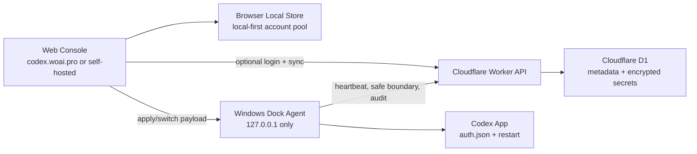

# Codex Dock

<p align="center">
  <strong>Codex App multi-account console with local-first storage, quota awareness, and safe smart switching.</strong>
</p>

<p align="center">
  <a href="https://github.com/atuizz/codex-dock/actions/workflows/ci.yml"></a>
  
  
  
  
</p>

Codex Dock 是一个面向 Codex App 重度用户和团队的账号池管理系统。它把多个账号的额度状态、Token 健康、可用性诊断、手动切换、自动切换和本地执行器收进同一个控制台，让你不用反复打开不同账号、手动替换 auth 文件或猜测哪个账号还能继续跑任务。

你可以直接使用托管版 [codex.woai.pro](https://codex.woai.pro)，也可以把整套 Cloudflare Worker + D1 + Windows Dock Agent 自部署到自己的域名。没有登录时，账号池只保存在当前浏览器本地；不会上传到云端，也不会进入 `codex.woai.pro` 的数据库。

> Codex Dock 是非官方工具，不隶属于 OpenAI。它不会绕过登录验证、手机号验证或服务限制，只管理你已经合法取得并授权使用的 Codex/ChatGPT 会话信息。

## 它解决什么

- 多账号额度分散：统一查看 5H / 7D 等额度快照、套餐、RT 可用性和账号健康状态。
- 手动切换成本高：通过本地 Dock Agent 写入 `%USERPROFILE%\.codex\auth.json` 并重启 Codex App。
- 自动切换容易误伤任务：只有在本机确认 Codex 处于安全边界后才换号，避免当前任务还能继续时抢切。
- 团队或多设备难同步：登录后可选择云同步；不登录则保持完全本地使用。
- 账号状态难排查：列表、详情、设备页和审计页会告诉你“为什么不能用”和“下一步该做什么”，而不是只显示失败。

## 快速使用

| 方式 | 适合谁 | 数据边界 |
| --- | --- | --- |
| 直接打开 [codex.woai.pro](https://codex.woai.pro) | 想马上管理本机账号池的个人用户 | 未登录时只写入当前浏览器本地存储，不上传账号数据 |
| 登录后使用云同步 | 多设备、团队、需要云端备份和审计的用户 | 只有确认同步后才上传；Token 以密文存入 D1 |
| 自部署 | 想完全掌控域名、数据库、密钥和发布流程的团队 | 你自己的 Cloudflare Worker、D1 和 Worker secret |

第一次使用建议：

1. 打开 [codex.woai.pro](https://codex.woai.pro) 或你的自部署域名。
2. 下载并启动 Dock Agent，确认页面显示 Agent 在线。
3. 导入你已经授权的 Codex/ChatGPT 账号会话。
4. 刷新额度，查看账号健康状态。
5. 使用手动切换，或在设置里开启智能切换。

## 功能亮点

| 模块 | 能力 |
| --- | --- |
| 账号池 | JSON 导入、账号搜索、套餐筛选、Token 状态、健康分组、批量处理 |
| 额度刷新 | 支持本机 Agent、云端 Worker、自动选择和仅手动刷新；云端刷新有每日限额保护 |
| 智能切换 | 可按 Plus/Pro/Team、RT 优先、冷却时间、当前账号避让等策略选择候选 |
| 任务连续性保护 | 依赖本机 Agent 上报 `safe_to_switch` 和 `boundaryConfirmed`，不会在活动任务中途强行替换 auth |
| Dock Agent | 本地监听 `127.0.0.1`，负责写 auth、重启 Codex、托盘驻留、日志诊断和更新检查 |
| 云同步 | 登录后可合并本地和云端账号池；管理员看不到其他用户的 Token 明文 |
| 审计与诊断 | 记录切换、刷新、失败原因、设备状态和管理员操作，所有 API 响应带 `X-Request-Id` |
| 自部署 | Cloudflare Worker Static Assets + Worker API + D1 + GitHub Actions 发布链路 |

## 隐私模型

Codex Dock 的默认使用方式是 local-first：

- 不登录：账号池、UI 偏好和同步策略保存在当前浏览器本地，页面不会把账号数据上传到云端。
- 使用 Dock Agent：Agent 只监听 `127.0.0.1`，校验来源后才写入本机 Codex auth 文件。
- 登录并选择同步：云端保存账号元数据、额度快照、设备状态和加密后的 auth/session payload。
- 管理员：可以管理云控制台用户、设备和统计，但不能查看其他用户的 Token 明文。
- 注销：`DELETE /api/me` 会级联删除用户账号、设备、session 和个人审计，只保留匿名删除计数。

更多边界说明见 [隐私与安全](docs/privacy-and-security.md)。

## 架构



浏览器是控制台，Worker 是可选云端协调层，D1 保存云端状态，Dock Agent 是唯一会触碰本机 Codex auth 文件的组件。

## 仓库结构

```text
.
├── index.html / app.js / styles.css      # Web 控制台入口和样式
├── account-*.js / panels-ui.js / ...     # 前端功能模块
├── cloud-worker/                         # Cloudflare Worker、D1 schema、迁移
├── native-helper/                        # Windows Dock Agent 源码
├── dist/CodexDockHelper/                 # 已构建的 Agent 分发包
├── scripts/                              # 本地验证、smoke、发布报告
├── docs/                                 # 架构、自部署、安全、发布文档
└── .github/workflows/                    # CI 和 Cloudflare 部署工作流
```

## 本地开发

环境要求：

- Node.js 24
- Windows PowerShell
- 部署时需要 Cloudflare Wrangler
- 如果要运行远端云后端，需要 Cloudflare 账号和 D1 数据库

安装 Worker 依赖并运行本地验证：

```powershell
npm --prefix cloud-worker ci
npm test
```

运行完整预检，包括 Windows Dock Agent 构建：

```powershell
npm run preflight
```

单独构建并启动 Dock Agent：

```powershell
.\native-helper\build-helper.ps1
.\dist\CodexDockHelper\CodexDockHelper.exe
```

本地 Agent 状态页：

```text
http://127.0.0.1:18766/
```

部署细节见 [自部署指南](docs/self-hosting.md)，发布验收见 [Release And Verification](docs/release-and-verification.md)。

## Cloud API

Worker 通过 `/api/*` 提供注册登录、账号 CRUD、额度刷新、智能切换 payload、设备注册、Agent 心跳、用户设置、审计和管理员视图。`GET /api/accounts` 只返回元数据和额度快照；auth 材料会加密保存，只有授权的切换 payload 请求才会解密。

主要路由组：

- `/api/auth/*` register, login, logout
- `/api/accounts/*` import, update, delete, usage refresh, switch payload
- `/api/settings/*` usage-refresh and auto-switch preferences
- `/api/devices/*` local Agent registration and authorization
- `/api/helper/*` heartbeat, current usage, next account, switch audit
- `/api/admin/*` user, device, audit and operations summary
- `/api/me` profile, password change and self-service deletion

## 文档

- [自部署指南](docs/self-hosting.md)：部署你自己的 Cloudflare Worker、D1 数据库和 Dock Agent。
- [隐私与安全](docs/privacy-and-security.md)：本地模式、云同步、Token 加密和 Agent 边界。
- [Cloud Local Architecture](docs/cloud-local-architecture.md)：当前实现形态和数据流。
- [Auto Switch Strategy](docs/auto-switch-task-continuity-strategy.md)：自动切换为什么要等待安全任务边界。
- [Release And Verification](docs/release-and-verification.md)：CI、smoke、生产部署和证据链。
- [Commercial Hardening Roadmap](docs/commercial-hardening-roadmap.md)：产品化路线图和质量门槛。

## 参与贡献

欢迎提交 issue 和 pull request。开始前请阅读 [CONTRIBUTING.md](CONTRIBUTING.md)，尤其是凭据脱敏、本地 Agent 行为和发布验证相关规则。

## 许可证

MIT License. See [LICENSE](LICENSE).
