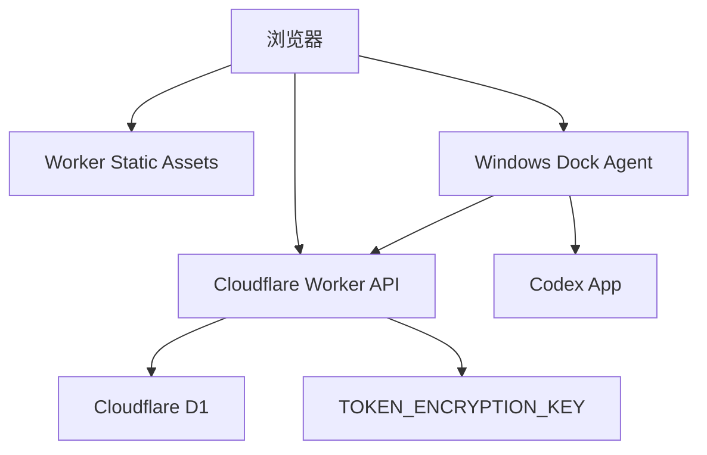

# 自部署指南

本文说明如何把 Codex Dock 部署到你自己的 Cloudflare 账号，并与 Windows Dock Agent 配对使用。

自部署不是必需项。如果只想使用托管控制台，可以直接打开 [codex.woai.pro](https://codex.woai.pro)。未登录时，账号数据只保存在浏览器本地，不会上传到托管后端。

## 部署形态



云端负责 Web 控制台、API、加密账号存储、设备状态和审计记录。本地 Dock Agent 仍然是必需的：一键切换需要在用户机器上写入 Codex App auth 文件并重启 Codex，这个动作不应该由远端服务直接执行。

## 环境要求

- Node.js 24
- npm
- 已登录或已配置凭据的 Wrangler
- Cloudflare 账号
- Cloudflare D1 数据库
- 用于构建和运行 Dock Agent 的 Windows 环境

## 1. 准备 Worker

在仓库根目录安装依赖：

```powershell
npm --prefix cloud-worker ci
```

构建静态资源：

```powershell
npm run build:assets
```

如果是全新部署，先创建 D1 数据库，并把生成的 `database_id` 写入 `cloud-worker/wrangler.jsonc`：

```powershell
cd cloud-worker
npx wrangler d1 create codex-cloud-console
```

全新数据库可以初始化完整 schema：

```powershell
npx wrangler d1 execute codex-cloud-console --remote --file ./schema.sql
```

已有数据库应使用增量迁移：

```powershell
npx wrangler d1 migrations list codex-cloud-console --remote
npx wrangler d1 migrations apply codex-cloud-console --remote
```

设置用于加密 auth/session payload 的 Worker secret：

```powershell
npx wrangler secret put TOKEN_ENCRYPTION_KEY
```

这个值应使用高熵密钥，并保存在仓库外。如果丢失该 secret，已加密的云端 payload 将无法解密。

## 2. 配置域名并部署

编辑 `cloud-worker/wrangler.jsonc`：

- `name`：Worker 名称。
- `routes.pattern`：你的自定义域名，例如 `codex.example.com`。
- `d1_databases[0].database_id`：你的 D1 数据库 id。
- `observability`：建议保持开启，方便排查请求。

部署：

```powershell
cd cloud-worker
npx wrangler deploy
```

部署后验证：

```powershell
curl.exe -I https://YOUR_DOMAIN/
curl.exe https://YOUR_DOMAIN/api/health
```

## 3. 构建并运行 Dock Agent

在 Windows 的仓库根目录执行：

```powershell
.\native-helper\build-helper.ps1
.\dist\CodexDockHelper\CodexDockHelper.exe
```

Agent 本地状态页：

```text
http://127.0.0.1:18766/
```

可选环境变量：

| 变量 | 用途 |
| --- | --- |
| `CODEX_PLUS_CLOUD_CONSOLE_URL` | 覆盖 Agent 使用的控制台地址，适合自部署或预览域名 |
| `CODEX_PLUS_ALLOWED_ORIGIN` | 额外允许调用本地 Agent API 的浏览器 Origin |
| `CODEX_PLUS_APP_ID` | 覆盖用于重启 Codex 的 Windows Shell AppID |
| `CODEX_DOCK_RESTORE_THREAD_PROTOCOL` | 会话深链恢复开关。默认会在 Codex 主窗口就绪后延迟调用一次 `codex://threads/...`；设为 `0`、`false` 或 `off` 可关闭 |

历史 `CODEX_PLUS_*` 命名保留是为了兼容已发布的本地 Agent 构建。

## 4. GitHub Actions 部署

仓库包含两个工作流：

- `.github/workflows/ci.yml`：push、pull request 和手动触发时运行 Windows 预检。
- `.github/workflows/cloudflare-deploy.yml`：手动验证并部署到 Cloudflare。

如果要使用 GitHub 托管部署，配置这些 repository secrets：

| Secret | 必需 | 用途 |
| --- | --- | --- |
| `CLOUDFLARE_API_TOKEN` | 是 | Worker 部署与 D1 迁移权限 |
| `CLOUDFLARE_ACCOUNT_ID` | 是 | Wrangler 使用的 Cloudflare account id |
| `CHECKOUT_TOKEN` | 否 | 私有仓库 checkout 兜底令牌 |

推送前建议在本地运行：

```powershell
npm run preflight
npm run release:report
```

生产部署后运行：

```powershell
cd cloud-worker
npm run smoke:production
cd ..
npm run smoke:production:surface
npm run release:report:production
```

## 运维注意事项

- 不要提交真实 `auth.json`、refresh token、access token、device bearer token 或 Worker secret。
- `GET /api/accounts` 不应返回任何 token 材料。
- 管理员页面用于运营和诊断，不用于查看凭据。
- 线上数据库升级使用 D1 migrations。不要对已有数据库重复执行完整 schema。
- 如果 Wrangler 显示有待迁移项，但远端表或列已经存在，应先检查 `sqlite_master`、`PRAGMA table_info(...)` 和 `d1_migrations`，再决定是否修复迁移账本。
